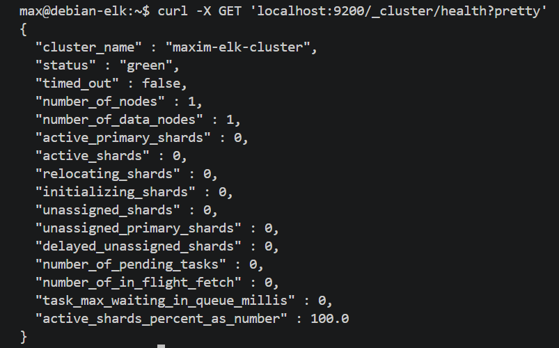
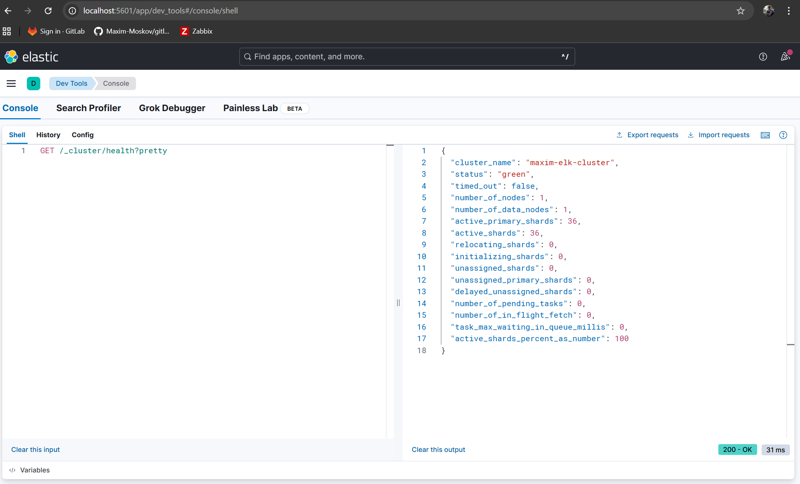
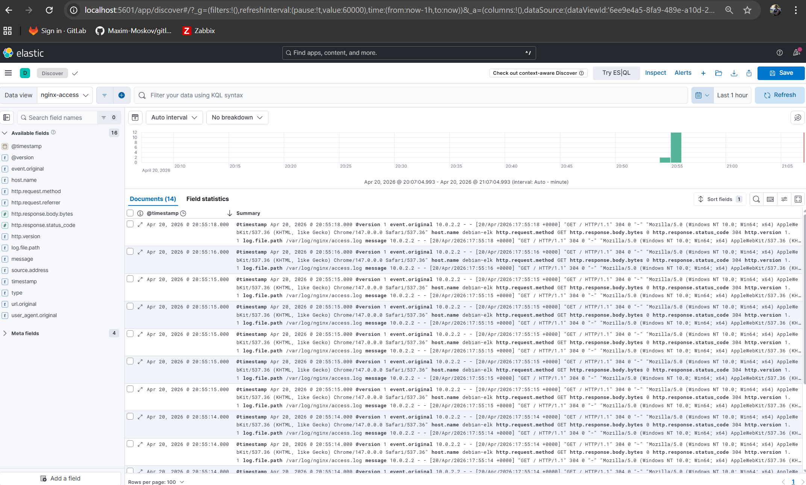
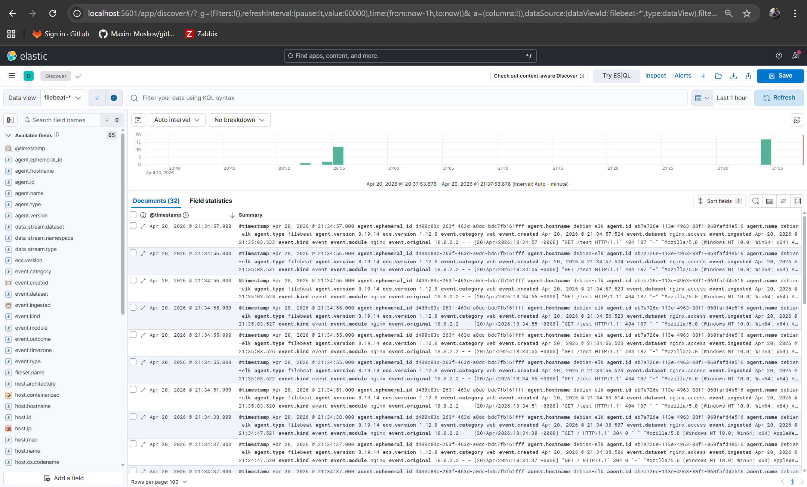

# Домашнее задание к занятию «ELK» - Моськов Максим

---

## Среда выполнения

Виртуальная машина на Debian 12 (bookworm), поднятая через Vagrant на VirtualBox — 6 ГБ RAM, 2 CPU. Из Windows-хоста проброшены порты: 5601 (Kibana), 9200 (Elasticsearch), 8080→80 (Nginx).

Весь стек ELK 8.19.14 установлен пакетами из APT-репозитория. Так как официальный репозиторий Elastic недоступен из РФ (403 Forbidden на `.deb`-артефакты), использовалось зеркало `mirror.yandex.ru/mirrors/elastic/8/`. Для учебных целей отключены TLS и x-pack security (`xpack.security.enabled: false`).

---

## Задание 1. Elasticsearch

Подключение репозитория Elastic (через зеркало Яндекса) и установка:

```bash
wget -qO - https://artifacts.elastic.co/GPG-KEY-elasticsearch | sudo gpg --dearmor -o /usr/share/keyrings/elastic-keyring.gpg
echo "deb [signed-by=/usr/share/keyrings/elastic-keyring.gpg] https://mirror.yandex.ru/mirrors/elastic/8/ stable main" | sudo tee /etc/apt/sources.list.d/elastic-8.x.list
sudo apt update
sudo apt install -y elasticsearch
```

В конфиге `/etc/elasticsearch/elasticsearch.yml` изменены параметры:

```yaml
cluster.name: maxim-elk-cluster
network.host: 0.0.0.0
discovery.type: single-node

xpack.security.enabled: false
xpack.security.enrollment.enabled: false
xpack.security.http.ssl.enabled: false
xpack.security.transport.ssl.enabled: false
```

Ограничение памяти JVM через `/etc/elasticsearch/jvm.options.d/memory.options`:

```
-Xms1g
-Xmx1g
```

Запуск сервиса:

```bash
sudo systemctl daemon-reload
sudo systemctl enable elasticsearch
sudo systemctl start elasticsearch
```

Проверка статуса кластера с нестандартным `cluster_name`:

```bash
curl -X GET 'localhost:9200/_cluster/health?pretty'
```



В выводе виден нестандартный `cluster_name: maxim-elk-cluster` — задание выполнено.

---

## Задание 2. Kibana

Установка:

```bash
sudo apt install -y kibana
```

В конфиге `/etc/kibana/kibana.yml` раскомментированы и изменены параметры:

```yaml
server.port: 5601
server.host: "0.0.0.0"
elasticsearch.hosts: ["http://localhost:9200"]
```

Запуск:

```bash
sudo systemctl daemon-reload
sudo systemctl enable kibana
sudo systemctl start kibana
```

В браузере открыт `http://localhost:5601/app/dev_tools#/console`, выполнен запрос:

```
GET /_cluster/health?pretty
```



В ответе `200 OK` виден тот же `cluster_name: maxim-elk-cluster` — Kibana успешно подключена к Elasticsearch.

---

## Задание 3. Logstash

Установка Logstash и Nginx:

```bash
sudo apt install -y nginx logstash
```

Чтобы Logstash мог читать логи Nginx, добавил его в группу `adm`:

```bash
sudo usermod -aG adm logstash
```

Создан пайплайн `/etc/logstash/conf.d/nginx.conf`:

```
input {
  file {
    path => "/var/log/nginx/access.log"
    start_position => "beginning"
    sincedb_path => "/dev/null"
    type => "nginx-access"
  }
}

filter {
  grok {
    match => { "message" => "%{COMBINEDAPACHELOG}" }
  }
  date {
    match => [ "timestamp", "dd/MMM/yyyy:HH:mm:ss Z" ]
  }
}

output {
  elasticsearch {
    hosts => ["http://localhost:9200"]
    index => "nginx-access-%{+YYYY.MM.dd}"
  }
  stdout { codec => rubydebug }
}
```

Logstash читает access-лог Nginx, парсит его grok-паттерном `COMBINEDAPACHELOG` и отправляет в индекс `nginx-access-YYYY.MM.dd`.

Запуск:

```bash
sudo systemctl daemon-reload
sudo systemctl enable logstash
sudo systemctl start logstash
```

После генерации трафика на `http://localhost:8080` индекс появился в Elasticsearch:

```bash
curl -X GET 'localhost:9200/_cat/indices?v'
```

```
yellow open nginx-access-2026.04.20 ... 14 ... 24.4kb
```

В Kibana создан Data View `nginx-access` с паттерном `nginx-access-*` и timestamp полем `@timestamp`. В разделе Discover видны записи с распарсенными полями (IP, метод, URL, статус, user-agent и т.д.).



---

## Задание 4. Filebeat

Logstash остановлен, старый индекс удалён:

```bash
sudo systemctl stop logstash
sudo systemctl disable logstash
curl -X DELETE 'localhost:9200/nginx-access-2026.04.20'
```

Установка Filebeat и включение встроенного модуля nginx:

```bash
sudo apt install -y filebeat
sudo filebeat modules enable nginx
```

В конфиге модуля `/etc/filebeat/modules.d/nginx.yml` активированы filesets:

```yaml
- module: nginx
  access:
    enabled: true
    var.paths: ["/var/log/nginx/access.log*"]

  error:
    enabled: true
    var.paths: ["/var/log/nginx/error.log*"]
```

В `/etc/filebeat/filebeat.yml` настроен output на Elasticsearch и Kibana (output.logstash закомментирован):

```yaml
output.elasticsearch:
  hosts: ["localhost:9200"]

setup.kibana:
  host: "localhost:5601"
```

Первичная инициализация (загружаются шаблоны индексов и dashboards в Kibana):

```bash
sudo filebeat setup
```

Запуск сервиса:

```bash
sudo systemctl enable filebeat
sudo systemctl start filebeat
```

После генерации трафика на Nginx в Elasticsearch появился индекс filebeat, в Kibana — соответствующий Data View `filebeat-*`. В разделе Discover видны логи Nginx, которые теперь приходят через Filebeat. Легко отличить их от предыдущего задания по полям с префиксом `nginx.access.*`, `agent.type: filebeat` и `event.module: nginx`:


